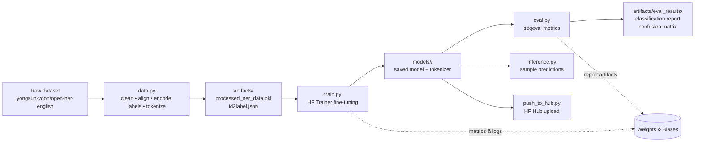

# NER Fine-Tuning Pipeline — MLOps Assignment 3

**IIT Jodhpur — PGD AI Program | Group 23**

An end-to-end MLOps pipeline that fine-tunes transformer-based Named Entity
Recognition (NER) models on the [`yongsun-yoon/open-ner-english`](https://huggingface.co/datasets/yongsun-yoon/open-ner-english)
dataset for **token-level entity classification** (e.g. `PER`, `ORG`, `LOC`, `MISC`).

The project demonstrates a complete MLOps lifecycle: data preparation →
training → evaluation → inference → model registry push, wrapped in a
reproducible CLI pipeline, containerized with Docker, and instrumented with
Weights & Biases (W&B) experiment tracking and GitHub Actions CI.

---

## Table of Contents

1. [Authors](#authors)
2. [Repository Structure](#repository-structure)
3. [Pipeline Architecture](#pipeline-architecture)
4. [Notebook](#notebook)
5. [Python Program (Script Pipeline)](#python-program-script-pipeline)
6. [Setup & Configuration](#setup--configuration)
7. [Running the Pipeline](#running-the-pipeline)
8. [Running with Docker](#running-with-docker)
9. [Pipeline Stages Explained](#pipeline-stages-explained)
10. [Model & Hyperparameter Configuration](#model--hyperparameter-configuration)
11. [Outputs / Artifacts](#outputs--artifacts)
12. [Experiment Tracking (W&B)](#experiment-tracking-wb)
13. [Links](#links)
14. [Troubleshooting](#troubleshooting)
15. [Notes & Acknowledgments](#notes--acknowledgments)

---

## Authors

| Roll Number | Name                  |
|-------------|-----------------------|
| G25AIT2017  | Anurag Vishwakarma    |
| G25AIT2125  | Vinod Krishnan Panicker |
| G25AIT2008  | Ananya Chaudhary      |

---

## Repository Structure

```text
mlops_project_group23/
├── src/
│   ├── main.py            # CLI entrypoint — orchestrates: data -> train -> eval -> inference -> hub push
│   ├── config.py           # Central config: reads .env / environment vars, detects CPU vs GPU,
│   │                        #   sets device-aware defaults (sample sizes, batch sizes, etc.)
│   ├── data.py              # Loads the dataset, cleans + validates token/label alignment,
│   │                        #   encodes labels to ids, tokenizes, caches processed data
│   ├── train.py              # Fine-tunes the token classification model via HF Trainer
│   ├── eval.py                # Loads the saved model, computes seqeval metrics,
│   │                          #   writes classification report + confusion matrix
│   ├── inference.py            # Runs the fine-tuned model on sample sentences
│   ├── push_to_hub.py            # Uploads tokenizer + model weights to the HF Hub
│   ├── utils.py                   # Shared helpers: cleaning, label utilities, metrics, seeding
│   └── wandb_utils.py               # Initializes / configures W&B runs
├── mlops-group-project.ipynb          # Primary exploratory notebook (also runnable end-to-end)
├── artifacts/                          # GENERATED — processed data, evaluation reports (not committed)
├── models/                              # GENERATED — fine-tuned model + tokenizer (not committed)
├── requirements.txt                      # Python dependencies
├── Dockerfile                             # Container definition for reproducible runs
├── .env.example                            # Template for required/optional environment variables
└── README.md
```

> **Note:** `artifacts/` and `models/` are created at runtime by the pipeline.
> If you're cloning fresh, these directories won't exist until you run
> `python src/main.py` (or the Docker equivalent) at least once.

---

## Pipeline Architecture



Each stage can be run independently (via `--skip-*` flags) or chained together
through `main.py`, which is what makes the pipeline suitable for both
interactive notebook exploration and unattended CI/Docker runs.

---

## Notebook

Primary notebook (recommended starting point for exploration / grading):

- [`mlops-group-project.ipynb`](mlops-group-project.ipynb)

The notebook mirrors the script pipeline stage-by-stage but with inline
visualizations (label distribution, training curves, confusion matrix) and
markdown commentary explaining each design decision.

---

## Python Program (Script Pipeline)

For environments where notebooks aren't ideal (CI runners, Docker, headless
servers), the same logic is available as a modular script pipeline under
`src/`:

| Script | Responsibility | Key inputs | Key outputs |
|---|---|---|---|
| `main.py` | CLI orchestrator — chains all stages, parses flags | CLI args | exit status, console logs |
| `config.py` | Single source of truth for configuration; reads `.env`, detects device, applies CPU/GPU-aware defaults | `.env` / env vars | config object used by all other scripts |
| `data.py` | Loads `yongsun-yoon/open-ner-english`, validates token↔label alignment, applies rare-entity policy, encodes labels, tokenizes with `AutoTokenizer`, aligns labels to subwords | dataset name, max samples | `processed_ner_data.pkl`, `id2label.json` |
| `train.py` | Fine-tunes the chosen model via `Trainer`, applies the selected hyperparameter profile (V1/V2) | processed dataset, model config | saved model + tokenizer, training logs/metrics |
| `eval.py` | Re-loads saved model, runs predictions on the validation split, computes precision/recall/F1/accuracy via `seqeval` | saved model, processed dataset | classification report (txt + json), confusion matrix PNG |
| `inference.py` | Runs the fine-tuned model on a small set of hardcoded/sample sentences to sanity-check predictions | saved model | console-printed entity predictions |
| `push_to_hub.py` | Pushes the fine-tuned model + tokenizer to a Hugging Face Hub repo | `HF_TOKEN`, `--repo` | live model card on HF Hub |
| `utils.py` | Shared utilities: text cleaning, label encode/decode helpers, metric computation wrappers, global seed-setting for reproducibility | — | — |
| `wandb_utils.py` | Initializes/finishes W&B runs, logs config + metrics + artifacts | `WANDB_API_KEY` | W&B run + artifact uploads |

---

## Setup & Configuration

### 1. Install dependencies

```bash
pip install -r requirements.txt
```

### 2. Create a `.env` file in the repo root

This file holds secrets and run-time overrides. **Never commit this file** —
use `.env.example` as the template.

```env
# --- Required secrets ---
WANDB_API_KEY=your_wandb_key_here     # Get from https://wandb.ai/authorize
HF_TOKEN=hf_your_token_here           # Get from https://huggingface.co/settings/tokens
                                       # (needs "write" scope if pushing to the Hub)

# --- Optional overrides (defaults shown / explained) ---

# Model to fine-tune. See "Model & Hyperparameter Configuration" for all options.
# Default: dslim/bert-base-NER (BERT-base, pre-fine-tuned on CoNLL-2003 NER)
MODEL_NAME=dslim/bert-base-NER

# Source dataset — change only if experimenting with alternative NER corpora
DATASET_NAME=yongsun-yoon/open-ner-english

# If true, training/validation are capped at the *_MAX_SAMPLES values below
# (useful for fast smoke tests). Set to false for full-dataset runs.
USE_SUBSET=true

# Sample caps used only when USE_SUBSET=true.
# NOTE: on CPU these are automatically reduced further by config.py
# (to 2000 / 400) regardless of the values set here, to keep runtimes
# reasonable on machines without a GPU — e.g. GitHub Actions runners.
TRAIN_MAX_SAMPLES=5000
VALIDATION_MAX_SAMPLES=1000

# Target repo for `push_to_hub.py` / `--push-to-hub`
HF_REPO=anuragvishwakarma02/mlops-group23-ner
```

#### Notes on configuration behavior

- **CPU auto-scaling:** `src/config.py` detects whether a CUDA-capable GPU is
  available. If running on CPU only, `TRAIN_MAX_SAMPLES` /
  `VALIDATION_MAX_SAMPLES` are forced down to `2000` / `400` even if larger
  values are set in `.env`. This was added so the **GitHub Actions CI
  pipeline** (which runs on CPU runners) completes in a reasonable time
  without manual intervention.
- **W&B is optional:** if `WANDB_API_KEY` is not set (or empty), W&B logging
  is silently disabled — the pipeline still runs and writes local artifacts,
  it just won't stream metrics to a dashboard.
- **Hub push is opt-in:** `HF_TOKEN` is only required if you pass
  `--push-to-hub`. The rest of the pipeline runs fine without it.

---

## Running the Pipeline

### Full pipeline (data → train → eval)

```bash
python src/main.py
```

### Useful Flags

| Flag | Description | Example use case |
|---|---|---|
| `--skip-data` | Skip data download/processing, reuse cached `artifacts/processed_ner_data.pkl` | Re-run training with different hyperparameters without re-processing data |
| `--skip-train` | Skip model fine-tuning | Re-run evaluation on an already-trained model |
| `--skip-eval` | Skip evaluation artifact generation | Train only, evaluate later separately |
| `--run-inference` | Run sample inference after evaluation | Quick qualitative sanity check on predictions |
| `--push-to-hub` | Push model + tokenizer to Hugging Face Hub | Publish the trained model for reuse / the assignment deliverable |
| `--repo` | Hub repo id, e.g. `your-username/mlops-group23-ner` | Required alongside `--push-to-hub` |
| `--private` | Create the Hub repository as private | Keep intermediate/experimental runs unlisted |

### Common command recipes

```bash
# 1) Fast smoke test — reuse cached data, skip training, just run inference
python src/main.py --skip-data --skip-train --skip-eval --run-inference

# 2) Re-run training with a new hyperparameter profile, then evaluate
python src/main.py --skip-data --run-inference

# 3) Full run + publish the model publicly
python src/main.py --push-to-hub --repo your-username/mlops-group23-ner

# 4) Full run + publish the model as a private Hub repo
python src/main.py --push-to-hub --repo your-username/mlops-group23-ner --private
```

---

## Running with Docker

Docker is the recommended path for **reproducible, environment-independent**
runs (and is what the CI pipeline uses under the hood).

### Build the image

```bash
docker build -t mlops-group23-ner .
```

### Run the full pipeline

```bash
docker run --rm \
  -e WANDB_API_KEY="<your-key>" \
  -e HF_TOKEN="<your-token>" \
  mlops-group23-ner
```

### Run with inference enabled

```bash
docker run --rm \
  -e WANDB_API_KEY="<your-key>" \
  -e HF_TOKEN="<your-token>" \
  mlops-group23-ner --run-inference
```

### Run and persist outputs to the host machine

By default, everything written inside the container (`artifacts/`, `models/`)
is lost when the container exits. Mount volumes to keep them:

```bash
mkdir -p artifacts models
docker run --rm \
  -e WANDB_API_KEY="<your-key>" \
  -e HF_TOKEN="<your-token>" \
  -v "$(pwd)/artifacts:/app/artifacts" \
  -v "$(pwd)/models:/app/models" \
  mlops-group23-ner
```

### Run and push the trained model to the Hub

```bash
docker run --rm \
  -e WANDB_API_KEY="<your-key>" \
  -e HF_TOKEN="<your-token>" \
  mlops-group23-ner --push-to-hub --repo your-username/your-model
```

> **Tip:** any flag accepted by `python src/main.py` can simply be appended
> after the image name in `docker run`, since the Dockerfile's entrypoint
> forwards CLI arguments straight to `main.py`.

---

## Pipeline Stages Explained

The pipeline executes the following stages in order (steps can be
individually skipped via the flags above):

1. **Load data** — `yongsun-yoon/open-ner-english` is pulled from Hugging
   Face Datasets via `data.py`.
2. **Clean & validate** — token/label sequence lengths are checked for
   alignment; a rare-entity policy collapses or drops entity types that
   appear too infrequently to be learned reliably.
3. **Label encoding** — entity tags are mapped to integer ids; the mapping is
   persisted to `id2label.json` so evaluation/inference can decode model
   outputs back to human-readable labels.
4. **Subsetting (optional)** — if `USE_SUBSET=true`, the train/validation
   splits are capped at `TRAIN_MAX_SAMPLES` / `VALIDATION_MAX_SAMPLES`
   (further reduced automatically on CPU — see configuration notes above).
5. **Tokenization** — the model's `AutoTokenizer` tokenizes text, and
   word-level labels are realigned to subword tokens (including handling of
   `-100` ignore-indices for special/continuation tokens).
6. **Fine-tuning** — `train.py` fine-tunes the chosen base model using
   Hugging Face `Trainer`, with hyperparameters from the selected profile
   (V1 or V2 — see below).
7. **Evaluation** — `eval.py` computes token-level precision, recall, F1, and
   accuracy using `seqeval`, and renders a confusion matrix across entity
   types.
8. **Logging (optional)** — if W&B is configured, training metrics, the
   classification report, and the confusion matrix image are logged as a W&B
   run + artifact.
9. **Hub push (optional)** — `push_to_hub.py` uploads the fine-tuned model and
   tokenizer to the configured Hugging Face Hub repo.

---

## Model & Hyperparameter Configuration

### Model options (`MODEL_NAME`)

| Key | Model | Notes |
|---|---|---|
| `0` (default) | [`dslim/bert-base-NER`](https://huggingface.co/dslim/bert-base-NER) | BERT-base, already fine-tuned on CoNLL-2003 NER — strong starting point for further fine-tuning |
| `1` | [`elastic/distilbert-base-uncased-finetuned-conll03-english`](https://huggingface.co/elastic/distilbert-base-uncased-finetuned-conll03-english) | DistilBERT — ~40% smaller/faster; used for quick CI/GitHub Actions runs |
| `2` | [`microsoft/deberta-v3-base`](https://huggingface.co/microsoft/deberta-v3-base) | DeBERTa-v3 — typically higher accuracy but heavier; best on GPU |

### Device-dependent training defaults

| Parameter | CPU default | GPU default |
|---|---|---|
| `TRAIN_MAX_SAMPLES` | 2000 | 5000 |
| `VALIDATION_MAX_SAMPLES` | 400 | 1000 |
| `MAX_LENGTH` | 256 | 256 |
| `USE_SUBSET` | true | true |

These are applied automatically by `config.py` based on `torch.cuda.is_available()`.

### Training hyperparameter profiles

Two profiles are defined in the notebook's configuration cell (and mirrored in
`config.py` / `train.py`). Switch between them by commenting/uncommenting the
relevant block.

**V1 — Default (faster convergence, good for iteration)**

| Parameter | Value |
|---|---|
| `LEARNING_RATE` | `3e-5` |
| `TRAIN_BATCH_SIZE` | `16` (GPU) / `8` (CPU) |
| `EVAL_BATCH_SIZE` | `16` (GPU) / `8` (CPU) |
| `NUM_TRAIN_EPOCHS` | `3` |
| `WEIGHT_DECAY` | `0.01` |
| `WARMUP_RATIO` | `0.1` |
| `LOGGING_STEPS` | `50` |

**V2 — Slower, more stable convergence (recommended for final/full runs)**

| Parameter | Value |
|---|---|
| `LEARNING_RATE` | `5e-5` |
| `TRAIN_BATCH_SIZE` | `16` (GPU) / `8` (CPU) |
| `EVAL_BATCH_SIZE` | `16` (GPU) / `8` (CPU) |
| `NUM_TRAIN_EPOCHS` | `5` |
| `WEIGHT_DECAY` | `0.01` |
| `WARMUP_RATIO` | `0.1` |
| `LOGGING_STEPS` | `50` |

> **When to use which:** V1 is faster and good for debugging the pipeline
> end-to-end or for CPU/CI smoke tests. V2 trades training time for more
> epochs at a higher learning rate, and is recommended once you're running on
> the **full dataset** (`USE_SUBSET=false`) for the final reported metrics.

---

## Outputs / Artifacts

After a full run, the following files are generated:

| Path | Description |
|---|---|
| `artifacts/processed_ner_data.pkl` | Cached, tokenized, label-aligned dataset (train + validation splits). Reused by `--skip-data` runs. |
| `artifacts/id2label.json` | Mapping from integer label ids back to entity tag strings (e.g. `0 -> "O"`, `1 -> "B-PER"`). Used by `eval.py` and `inference.py` to decode predictions. |
| `artifacts/eval_results/classification_report.txt` | Human-readable seqeval precision/recall/F1/accuracy per entity type. |
| `artifacts/eval_results/classification_report.json` | Same metrics in machine-readable JSON, suitable for downstream comparison or W&B logging. |
| `artifacts/eval_results/confusion_matrices.png` | Visual confusion matrix across entity classes. |
| `models/<model-name>/` | Fine-tuned model weights + tokenizer files, ready for `inference.py` or `push_to_hub.py`. |

---

## Experiment Tracking (W&B)

When `WANDB_API_KEY` is set (and `ENABLE_WANDB=true`, if applicable),
`wandb_utils.py` initializes a run under project **`mlops-group-23-project`**.

- **Logged during training:** loss curves, learning rate schedule, epoch/step
  metrics (precision, recall, F1, accuracy on the validation split).
- **Logged after evaluation, as an artifact:**
  - `classification_report.json`
  - `classification_report.txt`
  - the confusion matrix image

See the [W&B Project Dashboard](https://api.wandb.ai/links/g25ait2017-prom-iit-rajasthan/mek3r89q)
for example runs from this project.

If `WANDB_API_KEY` is missing or empty, the pipeline detects this and skips
all W&B calls — no errors are raised, and local artifacts are still written
normally.

---

## Links

- **GitHub Repository:** [anuragvishwakarma02/mlops_project_group23](https://github.com/anuragvishwakarma02/mlops_project_group23)
- **Kaggle Notebook V1:** [scriptVersionId=326129505](https://www.kaggle.com/code/anuragg25ait2017/mlops-group-project?scriptVersionId=326129505)
- **Kaggle Notebook V2:** [scriptVersionId=326275958](https://www.kaggle.com/code/anuragg25ait2017/mlops-group-project?scriptVersionId=326275958)
- **Hugging Face Model:** [anuragvishwakarma02/mlops-group23-ner](https://huggingface.co/anuragvishwakarma02/mlops-group23-ner)
- **Docker Image (Public):** [g25ait2017/mlops](https://hub.docker.com/r/g25ait2017/mlops/tags)
- **W&B Project Dashboard:** [g25ait2017-prom-iit-rajasthan/mek3r89q](https://api.wandb.ai/links/g25ait2017-prom-iit-rajasthan/mek3r89q)
- **Dataset:** [yongsun-yoon/open-ner-english](https://huggingface.co/datasets/yongsun-yoon/open-ner-english)

---

## Troubleshooting

| Symptom | Likely Cause | Fix |
|---|---|---|
| `FileNotFoundError` for `processed_ner_data.pkl`, `id2label.json`, or a saved model | Pipeline hasn't been run yet, or `--skip-*` was used before any artifact existed | Run the full pipeline at least once: `python src/main.py` |
| `--push-to-hub` fails with an auth/permission error | `HF_TOKEN` missing, expired, or lacks **write** scope; `--repo` not provided | Regenerate a token with write access at huggingface.co/settings/tokens; pass `--repo your-username/your-model` |
| W&B run doesn't appear on the dashboard | `WANDB_API_KEY` not set / not exported; `.env` not loaded | Confirm `.env` exists in repo root and `WANDB_API_KEY=...` is set; check console for "W&B disabled" message |
| Training is extremely slow / appears to hang on CPU | Running full-dataset config on CPU | Confirm `USE_SUBSET=true` (CPU auto-reduces to 2000/400 samples); consider using model option `1` (DistilBERT) for CPU runs |
| `CUDA out of memory` on GPU | Batch size too large for available VRAM | Reduce `TRAIN_BATCH_SIZE`/`EVAL_BATCH_SIZE`, or switch to a smaller model (`elastic/distilbert-...`) |
| Token/label length mismatch errors during tokenization | Dataset variant with unexpected tagging scheme, or `MAX_LENGTH` too small causing excessive truncation | Verify `DATASET_NAME` matches the expected schema; increase `MAX_LENGTH` if many sequences are being truncated |
| Docker build fails pulling dependencies | No network access to PyPI/Hugging Face from the build environment | Ensure outbound network access is allowed for `pypi.org`, `huggingface.co` during `docker build` |
| Notebook and script pipeline give slightly different metrics | Different `MODEL_NAME` / hyperparameter profile selected, or different `USE_SUBSET` sample sizes | Confirm both are using the same `.env` configuration and the same hyperparameter profile (V1 vs V2) |

---

## Notes & Acknowledgments

- Base model credit: [`dslim/bert-base-NER`](https://huggingface.co/dslim/bert-base-NER) (default), with alternatives from Elastic and Microsoft as listed above.
- Dataset credit: [`yongsun-yoon/open-ner-english`](https://huggingface.co/datasets/yongsun-yoon/open-ner-english) on the Hugging Face Hub.
- Evaluation metrics computed via [`seqeval`](https://github.com/chakki-works/seqeval), the standard library for sequence-labeling (NER/chunking) evaluation.
- This project was developed as **Assignment 3** for the MLOps course
  (CSL7040) in the IIT Jodhpur PGD AI program, by **Group 23**.
